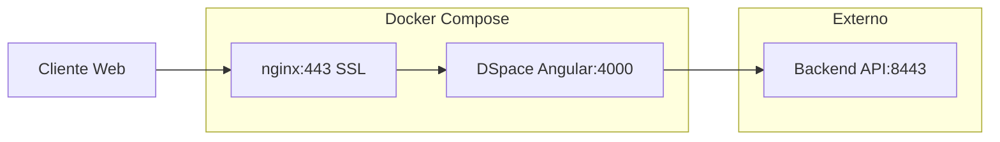

# DSpace Frontend - Despliegue Local con Docker

Este proyecto contiene la configuración para desplegar únicamente el frontend de DSpace utilizando Docker en un entorno local, conectándose a un backend de DSpace externo.

## Prerrequisitos para Desarrollo Local

### Hardware Mínimo
- **CPU**: 2 núcleos (2.0 GHz+)
- **RAM**: 4 GB mínimo, 6 GB recomendado para desarrollo
- **Almacenamiento**: 20 GB libre mínimo
- **Red**: Conexión estable a internet

### Software Requerido
- **Docker Desktop** versión 4.0 o superior
- **Git** con Git Bash (Windows)
- **OpenSSL** para generar certificados SSL

### Backend de DSpace
Este frontend se conecta a un backend DSpace externo que debe estar ejecutándose en:
`https://dspace-backend.local:8443/server`

## Configuración del Despliegue Local

### 1. Clonar el Repositorio

**⚠️ IMPORTANTE**: Debes clonar la rama `local` para la configuración de desarrollo local:

```bash
git clone -b local https://github.com/tu-repositorio/docker-dspace-frontend.git
cd docker-dspace-frontend
```

### 2. Configurar Hosts del Sistema

**CRÍTICO**: Debes agregar las siguientes entradas al archivo hosts:

#### Windows:
Editar `C:\Windows\System32\drivers\etc\hosts` (como Administrador) y agregar:
```
127.0.0.1    dspace.local
127.0.0.1    dspace-backend.local
```

#### Linux/macOS:
Editar `/etc/hosts` y agregar:
```bash
sudo nano /etc/hosts

# Agregar estas líneas:
127.0.0.1    dspace.local
127.0.0.1    dspace-backend.local
```

### 3. Generar Certificados SSL Locales

#### Para Windows (Git Bash):
```bash
# Crear directorio SSL
mkdir -p nginx/ssl/dspace.local

# Generar certificados autofirmados
openssl req -x509 -nodes -days 365 -newkey rsa:2048 \
  -keyout nginx/ssl/dspace.local/dspace.local.key \
  -out nginx/ssl/dspace.local/dspace.local.crt \
  -subj "//CN=dspace.local" \
  -config /c/openssl/openssl.cnf
```

#### Para Linux/macOS:
```bash
# Crear directorio SSL
mkdir -p nginx/ssl/dspace.local

# Generar certificados autofirmados
openssl req -x509 -nodes -days 365 -newkey rsa:2048 \
  -keyout nginx/ssl/dspace.local/dspace.local.key \
  -out nginx/ssl/dspace.local/dspace.local.crt \
  -subj "/CN=dspace.local"
```
### 4. Configurar Variables de Entorno

```bash
# Copiar el archivo de ejemplo
cp .env.example .env

# Editar el archivo .env con la configuración local
```

#### Variables de Entorno para Desarrollo Local:

```bash
# Configuración del Frontend
DSPACE_NAME="DSpace Instituto Colombiano de Antropología e Historia"
DSPACE_UI_URL=https://dspace.local
NGINX_HOST=dspace.local

# Configuración del Backend (debe estar ejecutándose)
DSPACE_REST_HOST=dspace-backend.local
DSPACE_REST_PORT=8443
DSPACE_SERVER_URL=https://dspace-backend.local:8443/server

# Certificados SSL locales
NGINX_SSL=dspace.local
CRT=dspace.local.crt
KEY=dspace.local.key
```

## Despliegue

### 1. Construir e Iniciar los Servicios

```bash
# Construir e iniciar en una sola vez
docker-compose up -d --build

# Ver estado de los contenedores
docker-compose ps

# Ver logs del frontend
docker-compose logs -f frontend-ui
```

### 2. Verificar el Despliegue

#### Verificar servicios:
```bash
# Estado de contenedores
docker-compose ps

# Verificar conectividad al backend
curl -k https://dspace-backend.local:8443/server/api

# Verificar frontend local
curl -k https://dspace.local
```

#### Acceder a la aplicación:
- **Frontend DSpace**: https://dspace.local
- **API DSpace**: https://dspace-backend.local:8443/server

## Desarrollo Local con Yarn (Sin Docker)

Esta sección es para desarrolladores que quieren probar cambios en el frontend sin usar contenedores Docker. El frontend se ejecutará en `http://localhost:4000` conectándose al backend en `dspace-backend.local:8443`.

### Prerrequisitos para Desarrollo

#### Software Requerido
- **Node.js** versión 18.x o 20.x
- **Yarn** versión 1.22+
- **Git** 
- Backend DSpace ejecutándose en `dspace-backend.local:8443`

#### Verificar Versiones
```bash
# Verificar Node.js
node --version  # Debe ser 18.x o 20.x

# Verificar o instalar Yarn
npm install -g yarn
yarn --version  # Debe ser 1.22+
```

### Configuración para Desarrollo

#### 1. Configurar el Archivo de Configuración
Copiar y editar el archivo de configuración de DSpace:

```bash
# Navegar al directorio del frontend
cd dspace-ui/src

# Copiar el archivo de ejemplo
cp config/config.example.yml config/config.yml

# Editar el archivo de configuración para desarrollo local
nano config/config.yml
```

**⚠️ Importante**: El archivo `config.yml` está en `.gitignore` y no se versiona. Cada desarrollador debe configurarlo localmente.

**Contenido del archivo `config/config.yml` para desarrollo:**
```yaml
# Configuración para desarrollo local con yarn
# Frontend: http://localhost:4000
# Backend: dspace-backend.local:8443

rest:
  ssl: true
  host: dspace-backend.local
  port: 8443
  nameSpace: /server

ui:
  ssl: false
  host: localhost
  port: 4000
  nameSpace: /

# Configuración adicional para desarrollo
cache:
  # Reduce cache para desarrollo más rápido
  serverSide:
    botCacheTimeToLive: 60000
    anonymousCache:
      max: 100
    
# Configuración de idioma
defaultLanguage: es
```

#### 2. Instalar Dependencias
```bash
# En el directorio dspace-ui/src
yarn install
```

#### 3. Verificar Conectividad al Backend
```bash
# Verificar que el backend responde
curl -k https://dspace-backend.local:8443/server/api
```

### Comandos de Desarrollo

#### Modo Desarrollo (Recomendado)
```bash
# Navegar al directorio del código fuente
cd dspace-ui/src

# Iniciar en modo desarrollo con hot reload
yarn start:dev

# El frontend estará disponible en: http://localhost:4000
```

#### Otros Comandos Útiles
```bash
# Build de producción local
yarn start:prod

# Tests unitarios con watch
yarn test

# Tests unitarios sin watch
yarn test:headless

# Linting del código
yarn lint

# Corrección automática de linting
yarn lint-fix

# Tests end-to-end (requiere frontend ejecutándose)
yarn e2e

# Build para desarrollo
yarn build

# Build para producción
yarn build:prod
```

### URLs de Desarrollo

| Servicio | URL | Descripción |
|----------|-----|-------------|
| Frontend Angular | http://localhost:4000 | Interfaz de usuario |
| Backend API | https://dspace-backend.local:8443/server | API REST de DSpace |

### Flujo de Trabajo de Desarrollo

1. **Iniciar el backend** DSpace (ver documentación del backend)
2. **Copiar y configurar** `config/config.example.yml` → `config/config.yml`
3. **Instalar** dependencias con `yarn install`
4. **Iniciar** desarrollo con `yarn start:dev`
5. **Desarrollar** con hot reload automático
6. **Probar** cambios en http://localhost:4000

### Diferencias entre Desarrollo y Producción

| Aspecto | Desarrollo (yarn) | Producción (Docker) |
|---------|-------------------|---------------------|
| URL Frontend | http://localhost:4000 | https://dspace.local |
| Configuración | `config/config.yml` (local) | Variables de entorno |
| SSL Frontend | No | Sí |
| Hot Reload | Sí | No |
| Build | Desarrollo | Producción optimizado |
| Archivo Config | Copiado de `config.example.yml` | Generado automáticamente |

### Ventajas del Desarrollo con Yarn

✅ **Hot Reload**: Cambios automáticos sin reiniciar  
✅ **Debugging**: Source maps completos para depuración  
✅ **Performance**: Compilación más rápida que Docker  
✅ **Flexibilidad**: Fácil cambio de configuración  
✅ **Herramientas**: Acceso completo a DevTools del navegador  

### Troubleshooting Desarrollo

#### Error de CORS
```bash
# Verificar configuración del backend
curl -k -I https://dspace-backend.local:8443/server/api

# El backend debe permitir conexiones desde localhost:4000
```

#### Error de certificados SSL
```bash
# El frontend usa HTTP, el backend HTTPS - esto es normal
# Verificar que el backend esté corriendo con SSL
curl -k https://dspace-backend.local:8443/server
```

#### Errores de compilación
```bash
# Limpiar caché y reinstalar
rm -rf node_modules yarn.lock
yarn install

# Verificar versión de Node.js
node --version  # Debe ser 18.x o 20.x
```

#### Problemas de conectividad
```bash
# Verificar archivo hosts
# Windows: C:\Windows\System32\drivers\etc\hosts
# Linux/Mac: /etc/hosts
# Debe contener: 127.0.0.1 dspace-backend.local
```

## Comandos Útiles

### Gestión de Contenedores

```bash
# Detener servicios
docker-compose down

# Reiniciar servicios
docker-compose restart

# Reconstruir y reiniciar
docker-compose up --build -d

# Ver uso de recursos
docker-compose top
```

### Logs y Depuración

```bash
# Logs de todos los servicios
docker-compose logs

# Logs con timestamp
docker-compose logs -t

# Seguir logs en tiempo real
docker-compose logs -f --tail=50

# Ejecutar shell en contenedor
docker-compose exec frontend-ui sh
docker-compose exec frontend-proxy sh
```

### Limpieza

```bash
# Detener y remover contenedores
docker-compose down

# Remover volúmenes
docker-compose down -v

# Limpiar imágenes no utilizadas
docker image prune -a

# Limpiar sistema completo
docker system prune -a
```

## Solución de Problemas Comunes

### 1. Error: "host not found in upstream backend"
**Síntoma**: Nginx no puede conectar al backend DSpace.

**Soluciones**:
```bash
# Verificar que el backend DSpace esté ejecutándose
curl -k https://dspace-backend.local:8443/server/api

# Verificar configuración DNS local en /etc/hosts o hosts de Windows
ping dspace-backend.local

# Reiniciar servicios frontend
docker-compose restart
```

### 2. Error: "SSL certificate not found" o "certificate verify failed"
**Síntoma**: Error al acceder a https://dspace.local.

**Soluciones**:
```bash
# Verificar que los certificados existan
ls -la nginx/ssl/dspace.local/

# Regenerar certificados si es necesario
openssl req -x509 -nodes -days 365 -newkey rsa:2048 \
  -keyout nginx/ssl/dspace.local/dspace.local.key \
  -out nginx/ssl/dspace.local/dspace.local.crt \
  -subj "/CN=dspace.local"

# Verificar permisos
chmod 644 nginx/ssl/dspace.local/dspace.local.crt
chmod 600 nginx/ssl/dspace.local/dspace.local.key
```

### 3. Error: "CORS policy" al cargar la aplicación
**Síntoma**: El frontend no puede comunicarse con el backend.

**Soluciones**:
```bash
# Verificar que el backend retorne URLs con puerto 8443
curl -k -H "Accept: application/hal+json" https://dspace-backend.local:8443/server/api

# Verificar configuración en .env
grep DSPACE_REST .env
grep DSPACE_SERVER_URL .env

# Reiniciar el frontend después de cambios en .env
docker-compose restart frontend-ui
```

### 4. Error: "Permission denied" en scripts
**Síntoma**: El contenedor no puede ejecutar scripts de inicio.

**Soluciones**:
```bash
# Verificar permisos del script
ls -la dspace-ui/scripts/start-frontend.sh

# Dar permisos de ejecución
chmod +x dspace-ui/scripts/start-frontend.sh

# Reconstruir el contenedor
docker-compose up -d --build frontend-ui
```

### 5. Contenedores no inician o se reinician constantemente
**Síntoma**: `docker-compose ps` muestra servicios con estado "Restarting".

**Soluciones**:
```bash
# Ver logs para identificar el error
docker-compose logs frontend-ui
docker-compose logs frontend-proxy

# Verificar configuración de variables de entorno
docker-compose config

# Verificar recursos disponibles
docker stats
```

### 6. La aplicación carga pero no muestra contenido
**Síntoma**: La página se carga pero no hay datos o funcionalidades.

**Soluciones**:
```bash
# Verificar conectividad al backend desde el contenedor
docker-compose exec frontend-ui curl -k https://dspace-backend.local:8443/server/api

# Verificar configuración de DSpace UI
docker-compose exec frontend-ui cat /dspace-ui/config/config.yml

# Revisar logs del backend DSpace para errores
# (consultar documentación del backend)
```

## Comandos de Mantenimiento

### Actualizaciones
```bash
# Actualizar código fuente
git pull origin main

# Reconstruir después de actualizaciones
docker-compose down
docker-compose up -d --build

# Limpiar imágenes antiguas
docker image prune -a
```

### Respaldo y Limpieza
```bash
# Crear respaldo de la configuración
tar -czf dspace-frontend-config-$(date +%Y%m%d).tar.gz .env nginx/ssl/

# Limpiar logs antiguos de Docker
docker system prune

# Verificar uso de espacio
docker system df
```
## Información Técnica

### Configuración para Desarrollo Local vs Producción

Este proyecto está configurado para **desarrollo local**. Los requisitos de hardware indicados anteriormente son para entornos de producción con múltiples usuarios concurrentes.

#### Para Desarrollo Local:
```yaml
CPU: 2 cores mínimo (cualquier CPU moderna)
RAM: 4 GB mínimo, 8 GB recomendado
Storage: 10 GB libres para contenedores
Network: Conexión a internet para descargar imágenes
Sistema: Windows 10/11, macOS, o Linux con Docker
```

#### Puertos Utilizados:
```bash
443   # HTTPS frontend (dspace.local)
4000  # Puerto interno del contenedor Angular
80    # HTTP redirigido a HTTPS
8443  # Puerto del backend DSpace (externo)
```

### Arquitectura del Frontend



### Variables de Entorno Importantes

| Variable | Descripción | Ejemplo Local |
|----------|-------------|---------------|
| `DSPACE_REST_HOST` | Host del backend DSpace | `dspace-backend.local` |
| `DSPACE_REST_PORT` | Puerto del backend | `8443` |
| `DSPACE_SERVER_URL` | URL completa de la API | `https://dspace-backend.local:8443/server` |
| `DSPACE_UI_URL` | URL del frontend | `https://dspace.local` |
| `NGINX_HOST` | Dominio para nginx | `dspace.local` |

### Estructura de Archivos Generados

```bash
# Después del despliegue exitoso
docker-dspace-frontend/
├── nginx/ssl/dspace.local/
│   ├── dspace.local.crt     # Certificado SSL autofirmado
│   └── dspace.local.key     # Clave privada SSL
├── .env                     # Variables de entorno configuradas
└── [resto de archivos del proyecto]
```

## Enlaces de Documentación

### DSpace
- **Backend DSpace**: https://versionamiento.icanh.gov.co/icanh/docker-dspace-backend
- [Documentación Oficial DSpace](https://wiki.lyrasis.org/display/DSDOC7x)
- [DSpace Angular GitHub](https://github.com/DSpace/dspace-angular)

### Docker
- [Docker Documentation](https://docs.docker.com/)
- [Docker Compose Reference](https://docs.docker.com/compose/)
- [Docker Best Practices](https://docs.docker.com/develop/dev-best-practices/)

### SSL y Certificados
- [OpenSSL Documentation](https://www.openssl.org/docs/)
- [Let's Encrypt (para producción)](https://letsencrypt.org/)
- [SSL Best Practices](https://ssl-config.mozilla.org/)

### Desarrollo y Troubleshooting
- [Angular SSR Documentation](https://angular.io/guide/universal)
- [Nginx Configuration Guide](https://nginx.org/en/docs/)
- [Node.js Best Practices](https://github.com/goldbergyoni/nodebestpractices)

---

## Notas de la Versión

**Versión**: 1.0.0  
**Fecha**: Enero 2025  
**Compatibilidad**: DSpace 7.x, Node.js 18+, Angular 16+  
**Estado**: Desarrollo Local - Listo para Producción  

### Cambios Recientes
- ✅ Eliminadas referencias al backend en nginx
- ✅ Configuración para puerto 8443 del backend
- ✅ Documentación mejorada para desarrollo local
- ✅ Scripts de SSL para múltiples plataformas
- ✅ Guía de solución de problemas expandida

### Próximas Mejoras
- [ ] Configuración automática de certificados con Let's Encrypt
- [ ] Script de inicialización automatizada
- [ ] Monitoreo con Prometheus/Grafana
- [ ] CI/CD con GitHub Actions