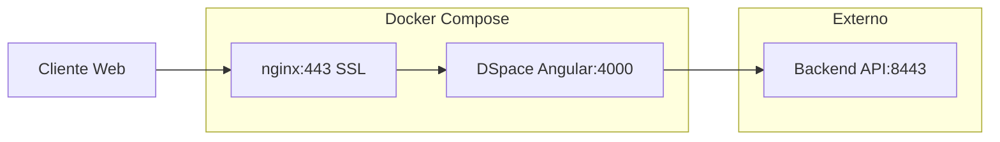

# DSpace Frontend - Despliegue Local con Docker

Este proyecto contiene la configuración para desplegar únicamente el frontend de DSpace utilizando Docker en un entorno local, conectándose a un backend de DSpace externo.

## Prerrequisitos para Desarrollo Local

### Sistema Operativo
- **Ubuntu 24.04 LTS** (recomendado)
- **Windows 10/11** con Git Bash
- **macOS** con Docker Desktop

### Software Requerido
- **Docker Engine** versión 24.0 o superior
- **Docker Compose** versión 2.20 o superior
- **Git Bash** (para Windows)
- **OpenSSL** para generar certificados autofirmados

### Backend de DSpace
Este frontend se conecta a un backend externo. Para configurar el backend de DSpace, consulta:
📖 **Documentación del Backend**: https://versionamiento.icanh.gov.co/icanh/docker-dspace-backend

### Instalación de Docker en Ubuntu 24.04

```bash
# Actualizar el sistema
sudo apt update && sudo apt upgrade -y

# Instalar dependencias
sudo apt install apt-transport-https ca-certificates curl software-properties-common -y

# Agregar la clave GPG oficial de Docker
curl -fsSL https://download.docker.com/linux/ubuntu/gpg | sudo gpg --dearmor -o /usr/share/keyrings/docker-archive-keyring.gpg

# Agregar el repositorio de Docker
echo "deb [arch=$(dpkg --print-architecture) signed-by=/usr/share/keyrings/docker-archive-keyring.gpg] https://download.docker.com/linux/ubuntu $(lsb_release -cs) stable" | sudo tee /etc/apt/sources.list.d/docker.list > /dev/null

# Instalar Docker
sudo apt update
sudo apt install docker-ce docker-ce-cli containerd.io docker-buildx-plugin docker-compose-plugin -y

# Agregar usuario al grupo docker
sudo usermod -aG docker $USER

# Reiniciar para aplicar cambios de grupo
newgrp docker
```

## Estructura del Proyecto

```
docker-dspace-frontend/
├── docker-compose.yml          # Configuración principal de Docker Compose
├── .env.example               # Plantilla de variables de entorno
├── .env                       # Variables de entorno (no incluido en Git)
├── .gitignore                # Archivos ignorados por Git
├── README.md                 # Este archivo
│
├── dspace-ui/                # Aplicación Angular de DSpace
│   ├── Dockerfile            # Imagen del frontend
│   ├── dspace-ui.json        # Configuración de DSpace UI
│   ├── scripts/              # Scripts de inicio
│   └── src/                  # Código fuente Angular
│       ├── angular.json
│       ├── package.json
│       ├── config/           # Configuraciones de DSpace
│       └── ...
│
└── nginx/                    # Proxy reverso
    ├── conf.d/
    │   └── default.conf.template  # Configuración de Nginx
    └── ssl/                  # Certificados SSL (no incluidos)
        └── [certificados]
```

## Configuración del Despliegue Local

### 1. Clonar el Repositorio

```bash
git clone <url-del-repositorio>
cd docker-dspace-frontend
```

### 2. Configurar Variables de Entorno

```bash
# Copiar el archivo de ejemplo
cp .env.example .env

# Editar las variables según tu configuración local
nano .env
```

#### Variables para Desarrollo Local:

```bash
# Nombre de tu institución
DSPACE_NAME="DSpace Instituto Colombiano de Antropología e Historia"

# Configuración del backend DSpace (debe estar ejecutándose)
DSPACE_REST_HOST=dspace-backend.local
DSPACE_REST_PORT=8443
DSPACE_SERVER_URL=https://dspace-backend.local:8443/server

# URL pública del frontend local
DSPACE_UI_URL=https://dspace.local
NGINX_HOST=dspace.local

# Certificados SSL locales
NGINX_SSL=dspace.local
CRT=dspace.local.crt
KEY=dspace.local.key
```

**⚠️ Importante**: Asegúrate de que el backend DSpace esté ejecutándose en `https://dspace-backend.local:8443/server`.
Para configurar el backend, consulta: https://versionamiento.icanh.gov.co/icanh/docker-dspace-backend

### 3. Generar Certificados SSL Autofirmados

#### Para Linux/macOS:
```bash
# Crear directorio para certificados
mkdir -p nginx/ssl/dspace.local

# Generar certificados autofirmados
openssl req -x509 -nodes -days 365 -newkey rsa:2048 \
  -keyout nginx/ssl/dspace.local/dspace.local.key \
  -out nginx/ssl/dspace.local/dspace.local.crt \
  -subj "/CN=dspace.local"
```

#### Para Windows (usar Git Bash):
```bash
# Abrir Git Bash y ejecutar:
mkdir -p nginx/ssl/dspace.local

# Generar certificados con configuración específica
openssl req -x509 -nodes -days 365 -newkey rsa:2048 \
  -keyout nginx/ssl/dspace.local/dspace.local.key \
  -out nginx/ssl/dspace.local/dspace.local.crt \
  -subj "//CN=dspace.local" \
  -config /c/openssl/openssl.cnf
```

**📖 Documentación adicional sobre certificados SSL:**
- [Documentación oficial de OpenSSL](https://www.openssl.org/docs/)
- [Configuración de openssl.cnf](https://www.openssl.org/docs/man1.1.1/man5/config.html)

### 4. Configurar DNS Local

Agregar entradas en el archivo `hosts` del sistema:

#### Linux/macOS:
```bash
# Editar /etc/hosts
sudo nano /etc/hosts

# Agregar estas líneas:
127.0.0.1    dspace.local
127.0.0.1    dspace-backend.local
```

#### Windows:
```bash
# Editar C:\Windows\System32\drivers\etc\hosts (como Administrador)
# Agregar estas líneas:
127.0.0.1    dspace.local
127.0.0.1    dspace-backend.local
```

## Despliegue

### 1. Construir e Iniciar los Servicios

```bash
# Construir e iniciar todos los servicios en una sola vez
docker-compose up -d --build

# Ver el estado de los contenedores
docker-compose ps

# Ver logs del frontend
docker-compose logs -f frontend-ui

# Ver logs del proxy nginx
docker-compose logs -f frontend-proxy
```

### 2. Verificar el Despliegue

#### Verificar que los servicios están corriendo:
```bash
# Verificar contenedores activos
docker-compose ps

# Verificar conectividad al backend DSpace
curl -k -H "Accept: application/hal+json" https://dspace-backend.local:8443/server/api

# Verificar respuesta del frontend local
curl -k https://dspace.local
```

#### Acceder a la aplicación:
- **Frontend DSpace**: https://dspace.local
- **API DSpace (verificación)**: https://dspace-backend.local:8443/server

### 3. Comandos Útiles de Desarrollo

```bash
# Detener servicios
docker-compose down

# Reconstruir servicios después de cambios
docker-compose up -d --build

# Ver logs en tiempo real de todos los servicios
docker-compose logs -f

# Limpiar volúmenes (⚠️ elimina datos persistentes)
docker-compose down -v

# Acceder al contenedor del frontend para debug
docker-compose exec frontend-ui /bin/bash

# Verificar configuración nginx
docker-compose exec frontend-proxy nginx -t

# Recargar configuración nginx sin reiniciar
docker-compose exec frontend-proxy nginx -s reload
```
docker-compose ps

# Verificar conectividad
curl -k https://mi-dspace.local
```

### 4. Acceder a la Aplicación

Abrir navegador y navegar a: `https://mi-dspace.local`

## Comandos Útiles

### Gestión de Contenedores

```bash
# Detener servicios
docker-compose down

# Reiniciar servicios
docker-compose restart

# Reconstruir y reiniciar
docker-compose up --build -d

# Ver uso de recursos
docker-compose top
```

### Logs y Depuración

```bash
# Logs de todos los servicios
docker-compose logs

# Logs con timestamp
docker-compose logs -t

# Seguir logs en tiempo real
docker-compose logs -f --tail=50

# Ejecutar shell en contenedor
docker-compose exec frontend-ui sh
docker-compose exec frontend-proxy sh
```

### Limpieza

```bash
# Detener y remover contenedores
docker-compose down

# Remover volúmenes
docker-compose down -v

# Limpiar imágenes no utilizadas
docker image prune -a

# Limpiar sistema completo
docker system prune -a
```

## Solución de Problemas Comunes

### 1. Error: "host not found in upstream backend"
**Síntoma**: Nginx no puede conectar al backend DSpace.

**Soluciones**:
```bash
# Verificar que el backend DSpace esté ejecutándose
curl -k https://dspace-backend.local:8443/server/api

# Verificar configuración DNS local en /etc/hosts o hosts de Windows
ping dspace-backend.local

# Reiniciar servicios frontend
docker-compose restart
```

### 2. Error: "SSL certificate not found" o "certificate verify failed"
**Síntoma**: Error al acceder a https://dspace.local.

**Soluciones**:
```bash
# Verificar que los certificados existan
ls -la nginx/ssl/dspace.local/

# Regenerar certificados si es necesario
openssl req -x509 -nodes -days 365 -newkey rsa:2048 \
  -keyout nginx/ssl/dspace.local/dspace.local.key \
  -out nginx/ssl/dspace.local/dspace.local.crt \
  -subj "/CN=dspace.local"

# Verificar permisos
chmod 644 nginx/ssl/dspace.local/dspace.local.crt
chmod 600 nginx/ssl/dspace.local/dspace.local.key
```

### 3. Error: "CORS policy" al cargar la aplicación
**Síntoma**: El frontend no puede comunicarse con el backend.

**Soluciones**:
```bash
# Verificar que el backend retorne URLs con puerto 8443
curl -k -H "Accept: application/hal+json" https://dspace-backend.local:8443/server/api

# Verificar configuración en .env
grep DSPACE_REST .env
grep DSPACE_SERVER_URL .env

# Reiniciar el frontend después de cambios en .env
docker-compose restart frontend-ui
```

### 4. Error: "Permission denied" en scripts
**Síntoma**: El contenedor no puede ejecutar scripts de inicio.

**Soluciones**:
```bash
# Verificar permisos del script
ls -la dspace-ui/scripts/start-frontend.sh

# Dar permisos de ejecución
chmod +x dspace-ui/scripts/start-frontend.sh

# Reconstruir el contenedor
docker-compose up -d --build frontend-ui
```

### 5. Contenedores no inician o se reinician constantemente
**Síntoma**: `docker-compose ps` muestra servicios con estado "Restarting".

**Soluciones**:
```bash
# Ver logs para identificar el error
docker-compose logs frontend-ui
docker-compose logs frontend-proxy

# Verificar configuración de variables de entorno
docker-compose config

# Verificar recursos disponibles
docker stats
```

### 6. La aplicación carga pero no muestra contenido
**Síntoma**: La página se carga pero no hay datos o funcionalidades.

**Soluciones**:
```bash
# Verificar conectividad al backend desde el contenedor
docker-compose exec frontend-ui curl -k https://dspace-backend.local:8443/server/api

# Verificar configuración de DSpace UI
docker-compose exec frontend-ui cat /dspace-ui/config/config.yml

# Revisar logs del backend DSpace para errores
# (consultar documentación del backend)
```

## Comandos de Mantenimiento

### Actualizaciones
```bash
# Actualizar código fuente
git pull origin main

# Reconstruir después de actualizaciones
docker-compose down
docker-compose up -d --build

# Limpiar imágenes antiguas
docker image prune -a
```

### Respaldo y Limpieza
```bash
# Crear respaldo de la configuración
tar -czf dspace-frontend-config-$(date +%Y%m%d).tar.gz .env nginx/ssl/

# Limpiar logs antiguos de Docker
docker system prune

# Verificar uso de espacio
docker system df
```
## Información Técnica

### Configuración para Desarrollo Local vs Producción

Este proyecto está configurado para **desarrollo local**. Los requisitos de hardware indicados anteriormente son para entornos de producción con múltiples usuarios concurrentes.

#### Para Desarrollo Local:
```yaml
CPU: 2 cores mínimo (cualquier CPU moderna)
RAM: 4 GB mínimo, 8 GB recomendado
Storage: 10 GB libres para contenedores
Network: Conexión a internet para descargar imágenes
Sistema: Windows 10/11, macOS, o Linux con Docker
```

#### Puertos Utilizados:
```bash
443   # HTTPS frontend (dspace.local)
4000  # Puerto interno del contenedor Angular
80    # HTTP redirigido a HTTPS
8443  # Puerto del backend DSpace (externo)
```

### Arquitectura del Frontend



### Variables de Entorno Importantes

| Variable | Descripción | Ejemplo Local |
|----------|-------------|---------------|
| `DSPACE_REST_HOST` | Host del backend DSpace | `dspace-backend.local` |
| `DSPACE_REST_PORT` | Puerto del backend | `8443` |
| `DSPACE_SERVER_URL` | URL completa de la API | `https://dspace-backend.local:8443/server` |
| `DSPACE_UI_URL` | URL del frontend | `https://dspace.local` |
| `NGINX_HOST` | Dominio para nginx | `dspace.local` |

### Estructura de Archivos Generados

```bash
# Después del despliegue exitoso
docker-dspace-frontend/
├── nginx/ssl/dspace.local/
│   ├── dspace.local.crt     # Certificado SSL autofirmado
│   └── dspace.local.key     # Clave privada SSL
├── .env                     # Variables de entorno configuradas
└── [resto de archivos del proyecto]
```

## Enlaces de Documentación

### DSpace
- **Backend DSpace**: https://versionamiento.icanh.gov.co/icanh/docker-dspace-backend
- [Documentación Oficial DSpace](https://wiki.lyrasis.org/display/DSDOC7x)
- [DSpace Angular GitHub](https://github.com/DSpace/dspace-angular)

### Docker
- [Docker Documentation](https://docs.docker.com/)
- [Docker Compose Reference](https://docs.docker.com/compose/)
- [Docker Best Practices](https://docs.docker.com/develop/dev-best-practices/)

### SSL y Certificados
- [OpenSSL Documentation](https://www.openssl.org/docs/)
- [Let's Encrypt (para producción)](https://letsencrypt.org/)
- [SSL Best Practices](https://ssl-config.mozilla.org/)

### Desarrollo y Troubleshooting
- [Angular SSR Documentation](https://angular.io/guide/universal)
- [Nginx Configuration Guide](https://nginx.org/en/docs/)
- [Node.js Best Practices](https://github.com/goldbergyoni/nodebestpractices)

---

## Notas de la Versión

**Versión**: 1.0.0  
**Fecha**: Enero 2025  
**Compatibilidad**: DSpace 7.x, Node.js 18+, Angular 16+  
**Estado**: Desarrollo Local - Listo para Producción  

### Cambios Recientes
- ✅ Eliminadas referencias al backend en nginx
- ✅ Configuración para puerto 8443 del backend
- ✅ Documentación mejorada para desarrollo local
- ✅ Scripts de SSL para múltiples plataformas
- ✅ Guía de solución de problemas expandida

### Próximas Mejoras
- [ ] Configuración automática de certificados con Let's Encrypt
- [ ] Script de inicialización automatizada
- [ ] Monitoreo con Prometheus/Grafana
- [ ] CI/CD con GitHub Actions